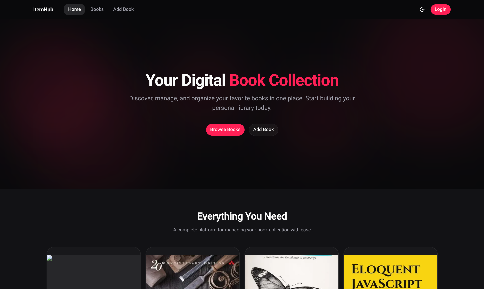

<div align="center">

# ItemHub

### Your Digital Book Collection management platform

[](https://github.com/AdalOnShow/itemHub-frontend)
[](https://github.com/AdalOnShow/ItemHub-backend)



</div>

---

## Tech Stack

<table>
<tr>
<td width="50%" valign="top">

### Frontend Technologies

| Technology                                                                                                             | Description            |
| ---------------------------------------------------------------------------------------------------------------------- | ---------------------- |
|              | App Router (v15+)      |
|                     | UI Library (v19)       |
|  | Styling Framework (v4) |
|           | Component Library      |
|                                         | Icon Library           |
|                                     | Dark Mode Support      |

</td>
<td width="50%" valign="top">

### Backend Technologies

| Technology                                                                                                     | Description          |
| -------------------------------------------------------------------------------------------------------------- | -------------------- |
|      | Runtime Environment  |
|  | Web Framework (v4)   |
|                                    | Cross-Origin Support |

</td>
</tr>
</table>

---

## Table of Contents

- [About the Project](#about-the-project)
- [Key Features](#key-features)
- [Project Structure](#project-structure)
- [Authentication](#authentication)
- [API Documentation](#api-documentation)
- [Installation](#installation)
- [Contact](#contact)

---

## About the Project

ItemHub is a full-stack digital book management platform designed for book lovers and collectors. It provides a streamlined experience for discovering, managing, and organizing your favorite books in one place.

The system features a modern, responsive design with a focus on usability, featuring an animated hero section and a clean interface for browsing and adding books to a collection.

### Project Objectives

- Build a comprehensive book management platform with a modern Next.js 15 frontend and Express backend.
- Implement a secure (mocked) authentication system to restrict administrative actions.
- Provide a responsive UI that works seamlessly across desktop and mobile devices.
- Demonstrate modern web development practices using shadcn/ui and Tailwind CSS 4.

---

## Key Features

### 1. Modern Landing Page

- 7-section design including Hero, Features, How it Works, Benefits, Book Preview, Testimonials, and CTA.
- Animated hero background with mouse interaction.

### 2. Book Management

- Browse a collection of books fetched from the backend API.
- Detailed views for individual books with descriptions and pricing.
- Add new books to the collection via a dedicated form (requires authentication).

### 3. Authentication System

- Mock login system with hardcoded credentials for demonstration.
- Cookie-based session management.
- Protected routes to prevent unauthorized access to book creation.

### 4. UI/UX Excellence

- Fully responsive card-based layout.
- Integrated Dark/Light mode support with persistence.
- Toast notifications for user feedback.
- Clean typography and modern aesthetics.

---

## Project Structure

```
ItemHub/
├── frontend/                # Next.js Frontend
│   ├── src/
│   │   ├── app/             # App Router pages & layouts
│   │   ├── components/      # UI & layout components
│   │   ├── hooks/           # Custom React hooks
│   │   ├── lib/             # Utility functions & API clients
│   │   └── proxy.js         # Auth proxy/middleware
│   ├── public/              # Static assets
│   └── package.json
│
└── backend/                 # Express Backend
    ├── index.js             # Main server & API endpoints
    └── package.json
```

---

## Authentication

ItemHub uses a mock authentication system for demonstration purposes. Users must log in to access administrative features like adding new books.

- **Test Email:** admin@example.com
- **Test Password:** 123456

Authentication is managed via a `setAuthCookie` function and verified through a proxy/middleware layer that protects internal routes.

---

## API Documentation

### Base URL

```
Local: http://localhost:5000
```

### Endpoints

| Method | Endpoint   | Auth | Description                      |
| ------ | ---------- | ---- | -------------------------------- |
| GET    | /books     | No   | Get all books in the collection  |
| GET    | /books/:id | No   | Get details for a specific book  |
| POST   | /books     | Yes  | Add a new book to the collection |

---

## Installation

### Prerequisites

- Node.js (v18 or higher)
- npm or yarn

### Setup

1. **Clone the repositories**

```bash
# Frontend
git clone https://github.com/AdalOnShow/itemHub-frontend
cd itemHub-frontend

# Backend (in a separate terminal or directory)
git clone https://github.com/AdalOnShow/ItemHub-backend
cd ItemHub-backend
```

2. **Frontend Installation**

```bash
cd frontend
npm install
npm run dev
```

3. **Backend Installation**

```bash
cd backend
npm install
npm start
```

The frontend will run on `http://localhost:3000` and the backend on `http://localhost:5000`.

---

## Contact

**Sharif Adal**

[](https://www.linkedin.com/in/adalonshow/)
[](mailto:sharifadal2008@gmail.com)

### Project Links

- **Frontend Repository:** [https://github.com/AdalOnShow/itemHub-frontend](https://github.com/AdalOnShow/itemHub-frontend)
- **Backend Repository:** [https://github.com/AdalOnShow/ItemHub-backend](https://github.com/AdalOnShow/ItemHub-backend)

---

<div align="center">

Made with ❤️ by [Sharif Adal](https://github.com/AdalOnShow)

Star this repo if you find it helpful!

</div>
